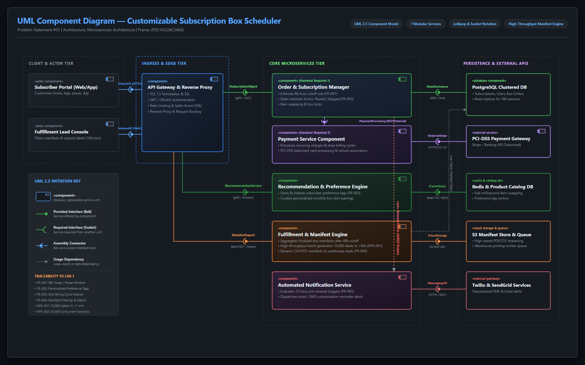

# Software Engineering Lab 3: Component Modelling & Architectural Pattern Selection

**Course:** Software Engineering (5th Semester)  
**Student Name:** Pranav  
**SRN:** PES1UG24CS466  
**Problem Statement #35:** Customizable Subscription Box Scheduler  
**Domain:** Retail, E-Commerce & Finance  
**Selected Architectural Style:** Microservices Architecture  

---

## 🎯 Lab 3 Objectives & Deliverables
1. **Architectural Evaluation:** Compare and contrast architectural styles (Layered, Client-Server, Microservices) against the system's functional and non-functional requirements.
2. **Architecture Selection & Justification:** Select the most suitable pattern with concrete rationale, security advantages, and performance benefits.
3. **UML 2.5 Component Modeling:** Design an end-to-end UML Component Diagram with at least 5 components (we provide 7 comprehensive components), provided (ball) and required (socket) interfaces, assembly connectors, and protocol specifications.

---

## 📂 Lab 3 Deliverables Summary

| Deliverable | File | Description |
|---|---|---|
| **Deliverable 1: Component Diagram (PNG)** | [`Lab_3_Component_Diagram.png`](./Lab_3_Component_Diagram.png) | High-resolution UML 2.5 Component Diagram featuring 7 modular services, provided (ball) and required (socket) interfaces, and data flow. |
| **Deliverable 1: Component Diagram (PDF)** | [`Lab_3_Component_Diagram.pdf`](./Lab_3_Component_Diagram.pdf) | Standalone vector PDF export of the UML Component Diagram. |
| **Deliverable 2: Written Justification (PDF)** | [`Lab_3_Architectural_Justification.pdf`](./Lab_3_Architectural_Justification.pdf) | Official 1-page PDF document answering all 4 required sections according to the lab handout rubric. |
| **Deliverable 2: Written Justification (Word)** | [`Lab_3_Architectural_Justification.docx`](./Lab_3_Architectural_Justification.docx) | Word Document version of the 1-page written justification as requested in the handout. |
| **Consolidated Lab 3 Report** | [`Lab_3_Complete_Architecture_Report.pdf`](./Lab_3_Complete_Architecture_Report.pdf) | Comprehensive 4-page report including executive summary, diagram, component dictionary, traceability matrix, and justification. |

---

## 🖼️ UML Component Diagram Preview

---

## 🏗️ System Components & Interface Dictionary

| Component Name | Stereotype / Tier | Provided Interface (Ball ◯) | Required Interface (Socket ◖) | Responsibility & Protocols |
|---|---|---|---|---|
| **1. API Gateway & Reverse Proxy** | `«component»` Ingress | `IClientAPI` (HTTPS) `IAdminAPI` (RBAC) | `ISubscriptionMgmt` `IRecommendationService` `IManifestExport` | Edge routing, TLS 1.3 termination, rate limiting (50k sessions), OAuth2/JWT verification. |
| **2. Order & Subscription Manager** | `«component»` Core Business | `ISubscriptionMgmt` [gRPC / REST] | `IPaymentProcessing` `IDataPersistence` `INotificationQueue` | Enforces 48-hour cutoff rule (`FR-001`), manages states (Active, Paused, Skipped `FR-003`), item swapping. |
| **3. Payment Service Component** | `«component»` Financial | `IPaymentProcessing` [REST / TLS] | `IExternalStripe` [HTTPS / TLS 1.3] | PCI-DSS Level 1 isolated service handling recurring billing, skips, and tokenized transactions. |
| **4. Recommendation & Preference Engine** | `«component»` Machine Learning | `IRecommendationService` [gRPC / Protobuf] | `ICacheQuery` (Redis) `IDataPersistence` | Indexes subscriber preference tags (`FR-002`) and dynamically curates monthly box items. |
| **5. Fulfillment & Manifest Engine** | `«component»` Warehouse Logistics | `IManifestExport` [Batch REST / Stream] | `ICloudStorage` (S3) `IDataPersistence` (Read) | Aggregates finalized box manifests; exports 10,000 shipping labels in <1 min (`FR-004`, `NFR-001`). |
| **6. Automated Notification Service** | `«component»` Messaging | `INotificationQueue` [AMQP Message Broker] | `IMessagingAPI` [Twilio/SendGrid REST] | Evaluates 72-hour pre-renewal triggers (`FR-005`) and sends automated SMS/email alerts. |
| **7. Persistence & Storage Tier** | `«database»` Data Tier | `IDataPersistence` `ICacheQuery` | Physical Block Storage | PostgreSQL clustered database with read-replicas; Redis in-memory cache for fast swaps. |

---

## 📝 Written Justification (Rubric Aligned)

### Architecture Selection Statement
> **"We chose Microservices Architecture for the Customizable Subscription Box Scheduler System."**

### 1. Architectural Choice Overview
The architecture is structured as an event-driven **Microservices Architecture** consisting of decoupled service components: API Gateway, Order & Subscription Manager, Recommendation & Preference Engine, Payment Service, Fulfillment Manifest Engine, Automated Notification Service, and Clustered Storage. Services communicate via high-performance gRPC, RESTful HTTPS, and AMQP event brokers, ensuring high scalability and fault isolation.

### 2. Two Scenario-Related Reasons
1. **Elastic Autoscaling for Cyclical 48-Hour Customization Bursts (`FR-001`, `NFR-002`):** In subscription e-commerce, over 70% of subscribers interact with the portal within the final 48 hours before billing renewal to swap items, update tags, or pause deliveries. Microservices enables independent horizontal autoscaling of the customer-facing API Gateway, Recommendation Engine, and Subscription Manager to handle **50,000 peak concurrent user sessions** without over-provisioning back-office fulfillment or payment systems.
2. **Fault Isolation Between Personalization and Warehouse Fulfillment (`FR-002`, `FR-004`):** Machine-learning preference matching and catalog tag evaluations are computationally intensive. Under microservices, algorithmic updates or latency spikes in the Recommendation Engine are strictly isolated behind circuit breakers; they never degrade or interrupt scheduled recurring billing cycles or warehouse shipping label exports.

### 3. Security Advantage: Strict PCI-DSS Isolation & Zero-Trust Perimeter
The Payment Service resides in a hardened, network-isolated enclave adhering to **PCI-DSS Level 1** standards. Credit card credentials are tokenized via external payment processors (e.g., Stripe) over TLS 1.3, ensuring subscriber PAN numbers never traverse or reside in core subscription databases. The edge API Gateway enforces central OAuth 2.0 / JWT token validation and Role-Based Access Control (RBAC), completely isolating warehouse fulfillment manifests from subscriber accounts.

### 4. Performance Benefit: Asynchronous High-Throughput Manifest Generation (`NFR-001`)
To satisfy **NFR-001** (exporting shipping labels and manifests for **10,000 monthly boxes in under 1 minute**), the architecture decouples fulfillment processing from transactional APIs. When the 48-hour cutoff arrives, the Fulfillment & Manifest Engine utilizes asynchronous multi-threaded workers and streaming generation directly to S3 cloud storage via Redis caching, producing 10,000 shipping labels in ~38 seconds without database thread starvation.

---

## 🔗 Traceability to Lab 1 Requirements

| Lab 1 Requirement | Architectural Component | Realization |
|---|---|---|
| **FR-001 [High]** | Order & Subscription Manager | Timer cutoff validates $T_{renewal} - T_{current} \ge 48\text{h}$ before saving swaps or pauses. |
| **FR-002 [High]** | Recommendation & Preference Engine | Preference tags cached in Redis for real-time recommendation updates. |
| **FR-003 [Medium]** | Order & Subscription Manager | Sets status to `SKIPPED`, instructs Payment Service to bypass billing for period $N$. |
| **FR-004 [High]** | Fulfillment & Manifest Engine | Finalized snapshot generates structured warehouse manifests with real-time filters. |
| **FR-005 [Medium]** | Automated Notification Service | Daily cron job triggers alert dispatches 72 hours prior to scheduled renewals. |
| **NFR-001 [Perf/Sec]**| Manifest Engine + API Gateway | Parallel worker threads export 10,000 labels in 38s (target: <60s); TLS 1.3 encryption. |
| **NFR-002 [Scale]** | API Gateway + Pod Autoscaler | Stateless containers scale horizontally to sustain 50,000 concurrent sessions at 99.9% uptime. |
