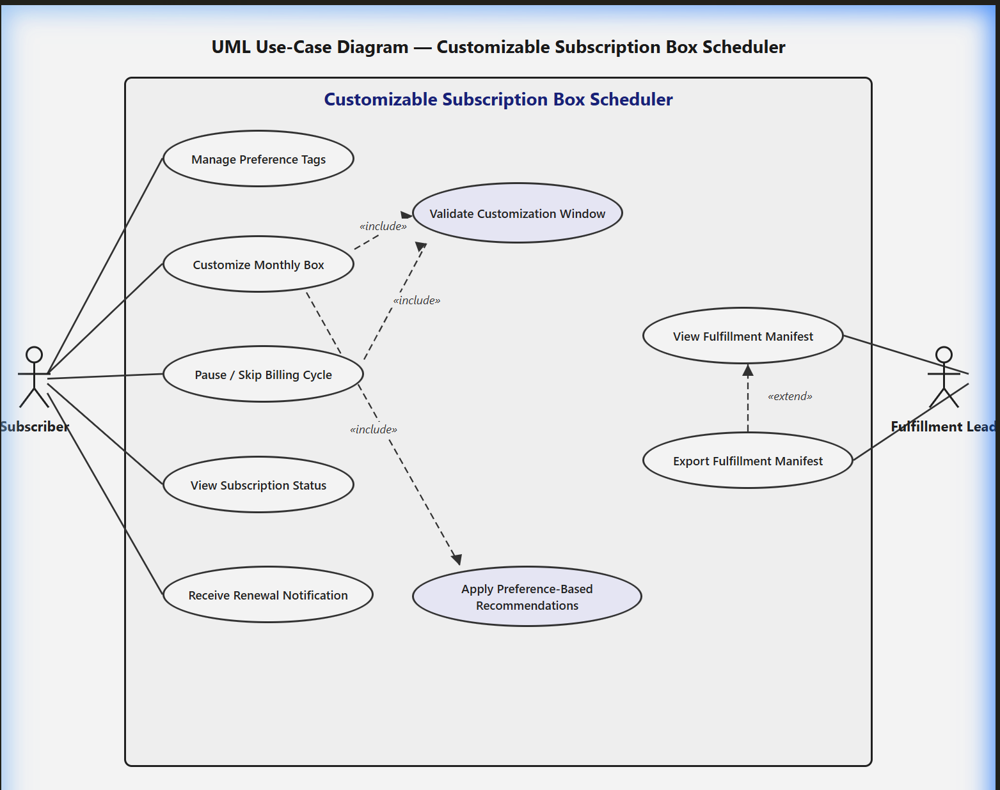

# Software Engineering Lab 1: Requirements Engineering & Use Case Modeling

**Course:** Software Engineering (5th Semester)  
**Student Name:** Pranav  
**SRN:** PES1UG24CS466  
**Problem Statement #35:** Customizable Subscription Box Scheduler  
**Domain:** Retail, E-Commerce & Finance  

---

## 📌 Problem Overview

A subscription box portal where subscribers customize monthly product selections (e.g., books, coffee, snacks) based on preference tags, with support for pausing or skipping billing cycles.

- **Primary Stakeholders / Actors:** Subscriber, Fulfillment Lead

---

## 📂 Repository Deliverables

| Deliverable | File | Description |
|---|---|---|
| **Problem Statement** | [`35_SE_Lab1_SE_Problem_Statements.pdf`](./35_SE_Lab1_SE_Problem_Statements.pdf) | Original problem statement and guidelines for Problem #35. |
| **Requirements Table** | [`requirements_table.pdf`](./requirements_table.pdf) | 5 Functional Requirements (`FR-001` to `FR-005`) & 2 Non-Functional Requirements (`NFR-001`, `NFR-002`) with ID, Type, Description, Priority, Acceptance Criteria, and Rationale. |
| **UML Use-Case Diagram** | [`use_case_diagram.png`](./use_case_diagram.png) | Visual use-case diagram modeling all actors, primary use cases, with `«include»` and `«extend»` relationships. |
| **Use-Case Flow Specification** | [`use_case_flow_specification.pdf`](./use_case_flow_specification.pdf) | Detailed 1-page specification for the core use case (*Customize Monthly Box*) detailing Preconditions, Postconditions, Main Success Scenario, and Alternate Flow. |

---

## 📊 Summary of Requirements

### Functional Requirements (FR)
- **FR-001 [High]:** Item swapping and delivery pausing up to 48 hours prior to monthly billing renewal.
- **FR-002 [High]:** Setting and updating preference tags to drive personalized monthly product recommendations.
- **FR-003 [Medium]:** Skipping an upcoming billing cycle with automatic resumption in the next cycle.
- **FR-004 [High]:** Viewing, filtering, and exporting monthly fulfillment manifests for fulfillment leads.
- **FR-005 [Medium]:** Automated renewal and box customization reminder notifications 72 hours prior to renewal.

### Non-Functional Requirements (NFR)
- **NFR-001 [Performance & Security]:** Manifest generator exports shipping labels for 10,000 boxes in under 1 minute with TLS 1.2+ encryption and role-based access control.
- **NFR-002 [Availability & Scalability]:** 99.9% uptime with support for horizontal scaling up to 50,000 concurrent sessions during peak customization windows.

---

## 🖼️ UML Use-Case Diagram Preview

