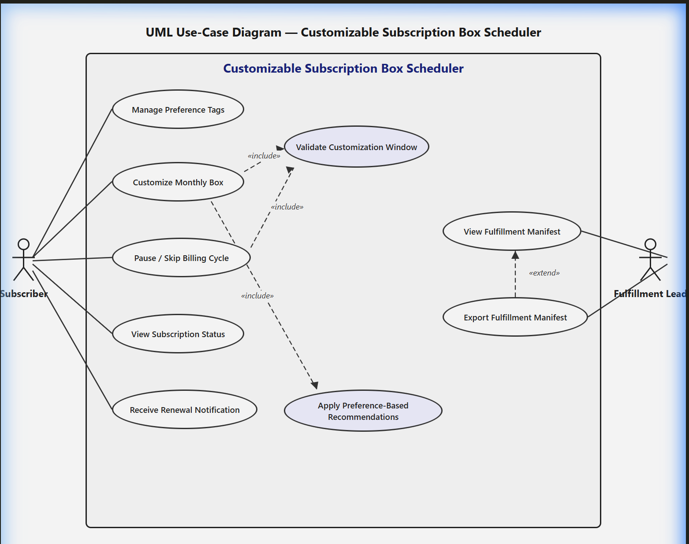
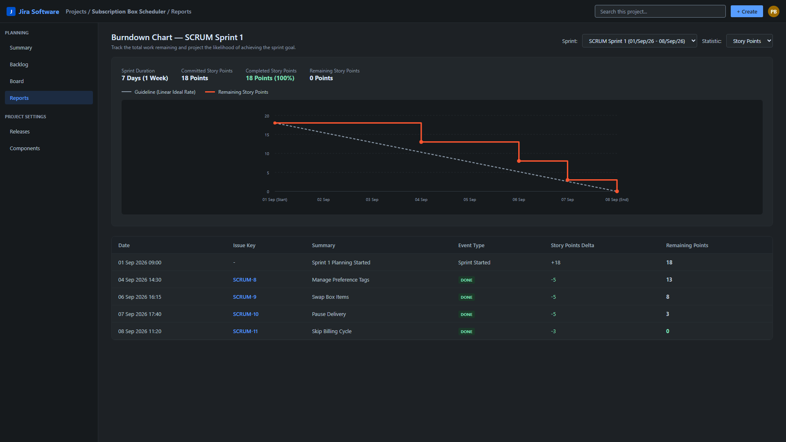

# Software Engineering Laboratory Portfolio: Problem Statement #35

**Course:** Software Engineering (5th Semester) &bull; Department of Computer Science &amp; Engineering &bull; PES University  
**Student Name:** Pranav  
**SRN:** PES1UG24CS466  
**Problem Statement #35:** Customizable Subscription Box Scheduler  
**Domain:** Retail, E-Commerce & Finance  
**Jira Workspace:** [sripranavbuduguru.atlassian.net](https://sripranavbuduguru.atlassian.net/) &bull; **Project Key:** `SCRUM`  
**GitHub Repository:** [Pranav-146/LAB1_Activity_Pranav_PES1UG24CS466](https://github.com/Pranav-146/LAB1_Activity_Pranav_PES1UG24CS466)

---

## 📑 Repository Quick Navigation

- [Lab 1: Requirements Engineering &amp; Use-Case Modelling](#-lab-1-requirements-engineering--use-case-modelling)
- [Lab 2: Agile Backlog Creation &amp; Sprint Simulation in Jira](#-lab-2-agile-backlog-creation--sprint-simulation-in-jira)
- [Lab 3: Component Modelling &amp; Architectural Pattern Selection](#-lab-3-component-modelling--architectural-pattern-selection)
- [Full Deliverables Directory Listing](#-repository-deliverables-index)

---

## 📌 Problem Overview: Customizable Subscription Box Scheduler

A subscription box portal where subscribers customize monthly product selections (e.g., books, coffee, snacks) based on preference tags, with support for pausing or skipping billing cycles.
- **Primary Stakeholders / Actors:** Subscriber, Fulfillment Lead

---

## 🔬 Lab 1: Requirements Engineering & Use-Case Modelling

### Summary of Requirements
- **FR-001 [High]:** Item swapping and delivery pausing up to 48 hours prior to monthly billing renewal.
- **FR-002 [High]:** Setting and updating preference tags to drive personalized monthly product recommendations.
- **FR-003 [Medium]:** Skipping an upcoming billing cycle with automatic resumption in the next cycle.
- **FR-004 [High]:** Viewing, filtering, and exporting monthly fulfillment manifests for fulfillment leads.
- **FR-005 [Medium]:** Automated renewal and box customization reminder notifications 72 hours prior to renewal.
- **NFR-001 [Performance & Security]:** Manifest generator exports shipping labels for 10,000 boxes in under 1 minute with TLS 1.2+ encryption and role-based access control.
- **NFR-002 [Availability & Scalability]:** 99.9% uptime with support for horizontal scaling up to 50,000 concurrent sessions during peak customization windows.

### Lab 1 Deliverables

| Deliverable | File | Description |
|---|---|---|
| **Problem Statement** | [`35_SE_Lab1_SE_Problem_Statements.pdf`](./35_SE_Lab1_SE_Problem_Statements.pdf) | Original problem statement and guidelines for Problem #35. |
| **Requirements Table** | [`requirements_table.pdf`](./requirements_table.pdf) | 5 Functional Requirements (`FR-001` to `FR-005`) & 2 Non-Functional Requirements (`NFR-001`, `NFR-002`). |
| **UML Use-Case Diagram** | [`use_case_diagram.png`](./use_case_diagram.png) | Visual use-case diagram modeling all actors, primary use cases, with `«include»` and `«extend»` relationships. |
| **Use-Case Flow Specification** | [`use_case_flow_specification.pdf`](./use_case_flow_specification.pdf) | Detailed 1-page specification for *Customize Monthly Box* (UC-002). |
| **Exception Flow Diagram** | [`Exception_Flow_Diagram.png`](./Exception_Flow_Diagram.png) | Diagram detailing exception and alternate paths for UC-002. |
| **Exception Flow Documentation** | [`Exception_Flow_Documentation.pdf`](./Exception_Flow_Documentation.pdf) | Formal documentation of exception handling. |



---

## 🏃 Lab 2: Agile Backlog Creation & Sprint Simulation in Jira

📁 **Dedicated Directory:** [`Lab2/`](./Lab2/)

### Objectives & Agile Transformation
Functional requirements from Lab 1 were decomposed into 3 major Agile Epics and 7 prioritized User Stories. Using **Planning Poker** with the **Fibonacci sequence**, relative effort estimates were assigned. Two consecutive 1-week sprints were simulated in Jira, transitioning tasks across `To Do` $\rightarrow$ `In Progress` $\rightarrow$ `Done`, with velocity monitored via Jira's Burndown Chart.

### Lab 2 Deliverables

| Deliverable | File | Description |
|---|---|---|
| **Deliverable 1: Epics PDF** | [`Lab2/Lab_2_Agile_Epics_and_Backlog.pdf`](./Lab2/Lab_2_Agile_Epics_and_Backlog.pdf) | Formal Epics catalog, 7 user stories, acceptance criteria, story point rationales, and backlog screenshots. |
| **Deliverable 2: Burndown PDF** | [`Lab2/Lab_2_Burndown_and_Sprint_Reflection.pdf`](./Lab2/Lab_2_Burndown_and_Sprint_Reflection.pdf) | Burndown Chart report, active sprint boards, and answers to the 4 reflection questions. |
| **Complete Lab 2 Report** | [`Lab2/Lab_2_Complete_Agile_Simulation_Report.pdf`](./Lab2/Lab_2_Complete_Agile_Simulation_Report.pdf) | Consolidated 4-page submission report containing all Lab 2 deliverables. |
| **Jira Backlog View** | [`Lab2/jira_backlog_view.png`](./Lab2/jira_backlog_view.png) | Backlog view showing Epics panel, Sprint 1 (18 SP), Sprint 2 (13 SP), and priority indicators. |
| **Jira Burndown Chart** | [`Lab2/jira_burndown_chart_view.png`](./Lab2/jira_burndown_chart_view.png) | Sprint 1 Burndown chart tracking remaining story points vs. linear guideline. |
| **Sprint 1 Active Board** | [`Lab2/Screenshot (569).png`](./Lab2/Screenshot%20(569).png) | Active Sprint 1 board simulation in Jira (`sripranavbuduguru.atlassian.net`). |
| **Sprint 2 Board (Start)** | [`Lab2/Screenshot (573).png`](./Lab2/Screenshot%20(573).png) | Sprint 2 started with 3 tasks in To Do. |
| **Sprint 2 Board (In Progress)** | [`Lab2/Screenshot (574).png`](./Lab2/Screenshot%20(574).png) | Sprint 2 progression. |
| **Sprint 2 Board (Done)** | [`Lab2/Screenshot (575).png`](./Lab2/Screenshot%20(575).png) | Sprint 2 completion (100% done). |

### Agile Epics & Stories Breakdown
- **Epic 1: Subscription Box Customization (10 SP)**
  - `SCRUM-8`: Manage Preference Tags (5 SP, High, FR-002)
  - `SCRUM-9`: Swap Box Items (5 SP, High, FR-001)
- **Epic 2: Subscription Cycle Management (8 SP)**
  - `SCRUM-10`: Pause Delivery (5 SP, High, FR-001)
  - `SCRUM-11`: Skip Billing Cycle (3 SP, Medium, FR-003)
- **Epic 3: Fulfillment & Renewal Management (13 SP)**
  - `SCRUM-12`: View Fulfillment Manifest (5 SP, High, FR-004)
  - `SCRUM-13`: Export Fulfillment Manifest (5 SP, High, FR-004, NFR-001)
  - `SCRUM-14`: Renewal Reminder Notifications (3 SP, Medium, FR-005)

### Burndown Chart Preview


### Summary Answers to Reflection Questions
1. **Did your estimations reflect the actual effort?** Yes; 5-point stories (SCRUM-9, SCRUM-13) had complex temporal boundaries (48h cutoff, 10,000 label batch generation in <60s), while 3-point stories (SCRUM-11, SCRUM-14) had simple states.
2. **Was your backlog well-prioritized?** Yes; customer-facing customization and pausing were prioritized into Sprint 1 for early value; fulfillment manifest operations and notifications were placed in Sprint 2.
3. **How did your simulated sprint align with your plan?** Both Sprint 1 (18 SP) and Sprint 2 (13 SP) completed 100% of tasks on schedule without mid-sprint scope creep.
4. **What insights did the burndown chart give about your team's capacity?** Established a sustainable velocity of 15–18 Story Points per 1-week sprint with steady linear progress.

---

## 🏛️ Lab 3: Component Modelling & Architectural Pattern Selection

📁 **Dedicated Directory:** [`Lab3/`](./Lab3/)

### Selected Architectural Style
> **"We chose Microservices Architecture for the Customizable Subscription Box Scheduler System."**

### Lab 3 Deliverables

| Deliverable | File | Description |
|---|---|---|
| **Deliverable 1: Component Diagram (PNG)** | [`Lab3/Lab_3_Component_Diagram.png`](./Lab3/Lab_3_Component_Diagram.png) | UML 2.5 Component Diagram featuring 7 modular services, provided (ball) and required (socket) interfaces, and data flow. |
| **Deliverable 1: Component Diagram (PDF)** | [`Lab3/Lab_3_Component_Diagram.pdf`](./Lab3/Lab_3_Component_Diagram.pdf) | Standalone vector PDF export of the Component Diagram. |
| **Deliverable 2: Written Justification (PDF)** | [`Lab3/Lab_3_Architectural_Justification.pdf`](./Lab3/Lab_3_Architectural_Justification.pdf) | Official 1-page PDF document answering all 4 required sections according to the lab handout rubric. |
| **Deliverable 2: Written Justification (Word)** | [`Lab3/Lab_3_Architectural_Justification.docx`](./Lab3/Lab_3_Architectural_Justification.docx) | Word Document version of the 1-page written justification. |
| **Complete Lab 3 Report** | [`Lab3/Lab_3_Complete_Architecture_Report.pdf`](./Lab3/Lab_3_Complete_Architecture_Report.pdf) | Consolidated 4-page report including executive summary, diagram, component dictionary, traceability matrix, and justification. |

### UML Component Diagram Preview


### Summary of Architectural Justification
- **Architectural Choice:** Event-driven Microservices Architecture decomposing the system into 7 services: API Gateway, Order & Subscription Manager, Recommendation & Preference Engine, Payment Service, Fulfillment Manifest Engine, Automated Notification Service, and Clustered Storage.
- **Two Specific Reasons:**
  1. *Elastic Autoscaling for 48-Hour Customization Bursts (FR-001, NFR-002):* Independent horizontal scaling of client-facing recommendation and customization pods to sustain **50,000 concurrent sessions** without over-provisioning back-office services.
  2. *Fault Isolation Between Personalization and Warehouse Fulfillment (FR-002, FR-004):* Algorithmic delays or model retraining in the Recommendation Engine do not block scheduled recurring billing or warehouse shipping label generation.
- **Security Advantage:** Dedicated **PCI-DSS Level 1** isolated Payment Service using tokenization and TLS 1.3 encryption (cardholder data never touches core databases); zero-trust OAuth 2.0 / JWT API Gateway enforces strict Role-Based Access Control (RBAC).
- **Performance Benefit:** Asynchronous batch processing satisfies **NFR-001** (exporting **10,000 box shipping labels in ~38 seconds**, well below the 1-minute requirement) via multi-threaded workers and direct S3 cloud streaming.

---

## 🗂️ Repository Deliverables Index

```
.
├── README.md                                    # Master Laboratory Portfolio (Labs 1, 2, and 3)
│
├── Lab 1 Files
│   ├── 35_SE_Lab1_SE_Problem_Statements.pdf     # Original Problem Statement #35
│   ├── requirements_table.pdf                   # Lab 1 Requirements Specification (5 FRs, 2 NFRs)
│   ├── use_case_diagram.png                     # Lab 1 UML Use-Case Diagram
│   ├── use_case_flow_specification.pdf          # Lab 1 Use-Case Flow Specification (UC-002)
│   ├── Exception_Flow_Diagram.png               # Lab 1 Exception Flow Diagram
│   └── Exception_Flow_Documentation.pdf         # Lab 1 Exception Flow Documentation
│
├── Lab 2 Files (Agile & Jira Simulation)
│   ├── Lab_2_Agile_Epics_and_Backlog.pdf        # Lab 2 Deliverable 1: Epics & Stories PDF
│   ├── Lab_2_Burndown_and_Sprint_Reflection.pdf # Lab 2 Deliverable 2: Burndown & Reflection PDF
│   ├── Lab_2_Complete_Agile_Simulation_Report.pdf # Lab 2 Consolidated 4-Page Submission PDF
│   └── Lab2/                                    # Dedicated Lab 2 Directory
│       ├── README.md                            # Comprehensive Lab 2 documentation
│       ├── Lab_2_Agile_Epics_and_Backlog.pdf
│       ├── Lab_2_Burndown_and_Sprint_Reflection.pdf
│       ├── Lab_2_Complete_Agile_Simulation_Report.pdf
│       ├── jira_backlog_view.png                # Jira Backlog Screenshot
│       ├── jira_burndown_chart_view.png         # Jira Burndown Chart Screenshot
│       ├── Screenshot (569).png                 # Sprint 1 Active Board
│       ├── Screenshot (573).png                 # Sprint 2 Start Board
│       ├── Screenshot (574).png                 # Sprint 2 In Progress Board
│       ├── Screenshot (575).png                 # Sprint 2 Completed Board
│       └── sprint1_burndown_chart.png
│
└── Lab 3 Files (Component Modelling & Architecture)
    ├── Lab_3_Component_Diagram.png              # Lab 3 Deliverable 1: Component Diagram PNG
    ├── Lab_3_Component_Diagram.pdf              # Lab 3 Deliverable 1: Component Diagram PDF
    ├── Lab_3_Architectural_Justification.pdf    # Lab 3 Deliverable 2: 1-Page Written Justification PDF
    ├── Lab_3_Architectural_Justification.docx   # Lab 3 Deliverable 2: 1-Page Written Justification DOCX
    ├── Lab_3_Complete_Architecture_Report.pdf   # Lab 3 Consolidated 4-Page Architecture Report
    └── Lab3/                                    # Dedicated Lab 3 Directory
        ├── README.md                            # Comprehensive Lab 3 documentation
        ├── Lab_3_Component_Diagram.png
        ├── Lab_3_Component_Diagram.pdf
        ├── Lab_3_Architectural_Justification.pdf
        ├── Lab_3_Architectural_Justification.docx
        └── Lab_3_Complete_Architecture_Report.pdf
```
